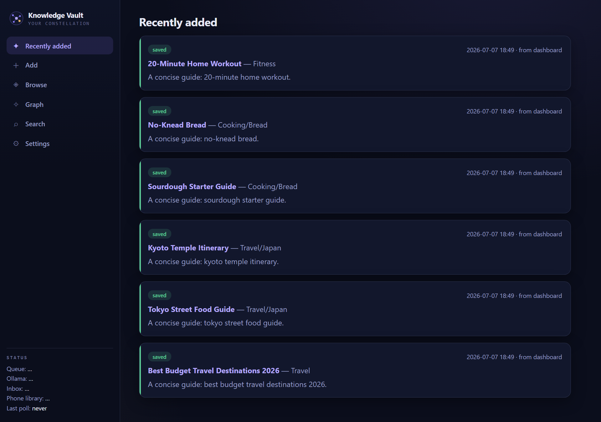
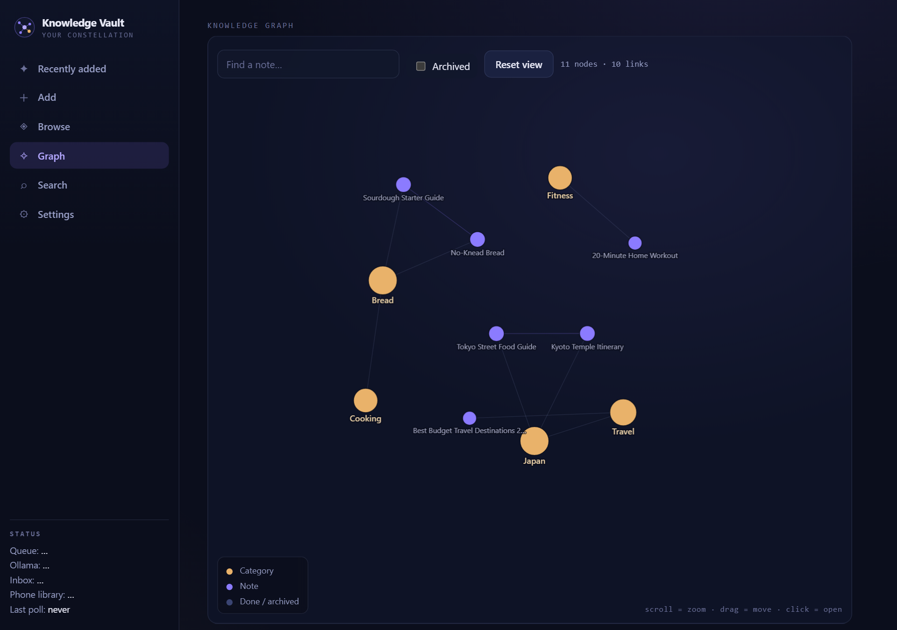
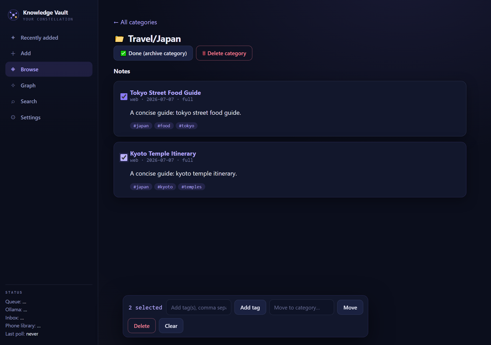
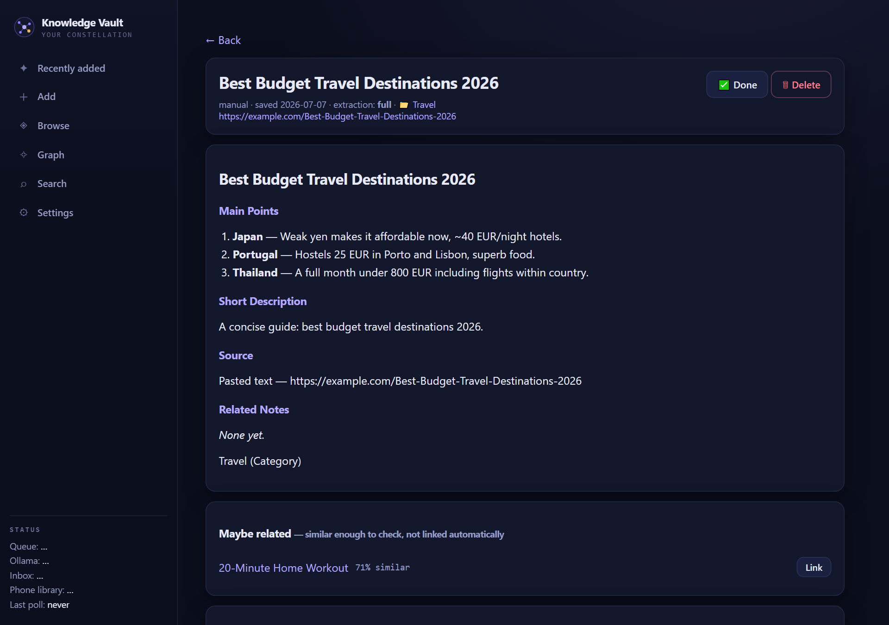

# Notulus

Save reels, videos, and articles and get back a short, useful note — not a
transcript. Everything runs **locally on your own PC** using a free local AI
(no subscriptions, no cloud AI, nothing you save ever leaves your computer
except an optional link sent from your phone).

Notes are saved as plain Markdown files in an [Obsidian](https://obsidian.md)
vault, automatically organized into folders, deduplicated, and searchable —
plus a knowledge graph so you can see how everything connects.

  
  

  
  

## What you need

- **Windows 10 or 11.**
- About **10 GB free disk space** and **10–15 minutes** the first time (the
  setup downloads a local AI model).
- A reasonably modern PC. It works on a laptop with no dedicated graphics
  card too — it'll just be slower per note.

No coding knowledge needed — everything below is a double-click.

## Quick start

1. Click the green **Code** button at the top of this page → **Download ZIP**.
2. Extract the ZIP anywhere (e.g. your Desktop).
3. Open the extracted folder and double-click **`Setup Knowledge Vault.bat`**.
   Follow what it prints — it installs everything needed (the free local AI
   [Ollama](https://ollama.com), Node.js, your vault folder) and deploys your
   phone inbox automatically. The only thing it can't do for you is log you
   into your own free Cloudflare account — a browser tab opens for that one
   step, then setup continues on its own.
4. Double-click **`Start Knowledge Vault.bat`**. A dashboard opens in your
   browser at `http://localhost:8765` — you're ready to save your first link.

Your notes end up in a **`Knowledge Vault`** folder next to the app folder.
Open that folder in Obsidian any time to browse your notes directly.

## Using it

- **Add** — paste a link (Instagram reel, TikTok, YouTube, an article) or any
  raw text. It's processed automatically and shows up in **Recently added**.
- **Browse** / **Search** — your notes, organized into folders that grow on
  their own as you save more. Tick multiple notes to tag, move, or delete
  them all at once.
- **Graph** — a visual map of your notes and categories, similar to
  Obsidian's graph view.
- **Maybe related** — on a note's page, similar notes that weren't quite
  close enough to link automatically are suggested, with a one-click Link
  button to confirm them.
- **Backups** — a snapshot of your database is taken automatically every
  time the app starts (Settings → Backups also has a manual "Back up now").
  Your Markdown notes are already safe in the vault folder; this covers the
  search index, categories, and links that only live in the database.
- **Phone capture (optional)** — setup deploys your phone inbox automatically
  (you only approve a Cloudflare login popup, nothing to click through). Once
  that's done, open the file `PHONE-SETUP.md` that appears in this folder for
  the last step: installing the app on your phone, so you can share a reel
  with one tap, even while your PC is off — it'll be waiting for you next
  time you turn the PC on. If the automatic part can't finish (e.g. no
  internet, or you'd rather not install Node.js), that same file has a
  manual walkthrough instead.

## Privacy

All AI analysis (reading the video/article and writing the note) happens on
your PC using Ollama — nothing is sent to any AI company. The only thing that
ever leaves your PC is the link/text you share from your phone (which needs
somewhere to wait until your PC turns on) and the pages you ask it to fetch.

## If something goes wrong

- **"Ollama is not running"** on the dashboard → open the Ollama app from
  your Start menu, then it resumes automatically.
- **Setup can't find Python** → install [Python 3.12](https://www.python.org/downloads/)
  first (tick "Add python.exe to PATH" during install), then rerun setup.
- **Port already in use** → close any other copy of Notulus that
  might already be running, or change `"port"` in `config.json` (created
  after first setup) and restart.
- **Automatic phone inbox setup didn't finish** → setup prints why and falls
  back to a manual walkthrough in `PHONE-SETUP.md` — nothing else is
  affected, the rest of the app works either way.
- Re-running `Setup Knowledge Vault.bat` any time is safe — it only fixes or
  fills in what's missing.
